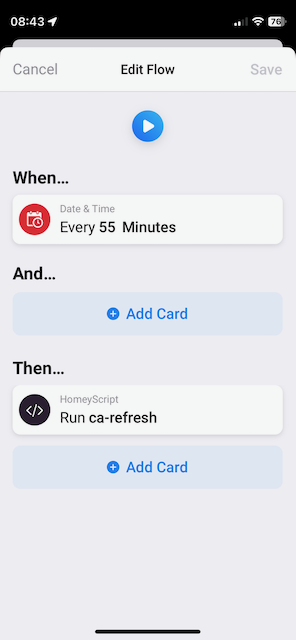
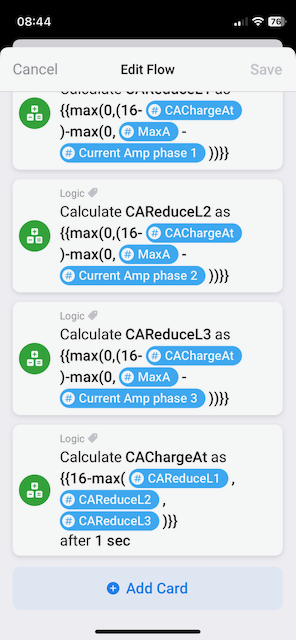

# chargeamps

Scripts and tools to work with the Charge Amps EAPI.

https://eapi.charge.space/swagger

## maxcurrent

Bash script to demonstrate how to login, and use the EAPI.
It can show status, and set the max current of the first
charge box.

## Homey as a load balancer

A Homey can act as a load balancer, triggering a flow
when the current of one of the phases gets to close to
max (I have 25 A master fuse, and start load balance at
24 A).

This flow set a load balancing variable for this phase,
and calculate the max current that can be used by the
charge box, and set that as a Better Logic variable.

There is of course identical flows for phase 2 and 3.

Another flow is triggering when this variable is changed,
and call a Homescript to set the value in the Charge Amps
EAPI.

A periodig flow is checking if the load balancing can be
decreased, and increase the charge current. Eventually it
will come back to full power (16 A).

Another periodically flow is refreshing the token, with a
Homeyscript, to the EAPI.

### Installation and configuration

To get started, make sure you have some kind of measurement
device of the total current drawn per phase for your house.
I use Homewizard P1 dongle, which got an app for Homey.
It gives me the trigger possibility.

Install Better Logic Library app in Homey.

Configure Homey Number Variables for the load balancer, by
going into More->Variables, and add according to

* ChargeAt - set your default to 16
* LoadBalL1 - Current limitation needed for L1 (0)
* LoadBalL2 - Current limitation needed for L2 (0)
* LoadBalL3 - Current limitation needed for L3 (0)
* MaxA - When to start load balance (24)

Also create the following Text variables:

* ca-email - your e-mail address/login to Charge Amps
* ca-password - your password to Charge Amps
* ca-apikey - Charge Amps apiKey, that you can get from your Charge Amps contact

The Homey scripts and example flows how to use the EAPI
from Homey, can be found in [homey](homey/).

Copy paste each [homeyscript](./homey/homeyscript/) into a new Homey script using
your web browser at https://my.homey.app

Create corresponding flows for each script, see example screen shots.

Create three of the following, one for each phase:
 

Run the CAlogin script manually, to grab the first token. It will then be
able to refresh automatically.

You can monitor, perhaps with Homey Insights, the value of ChargeAt variable.

You can also run the ca-status.js Homescript to grab current status. Use
the Homey Web app, to run it, and receive the output.

# Contact

If you need apikey, use your Charge amps contact.

If you want to talk to me, try no@nod.se
